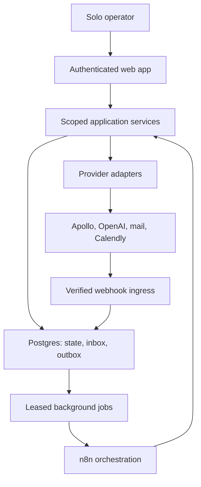

# Architecture — Milestone 0

Status: specification-level architecture review completed; findings and deferred decisions are recorded below. This document specifies future behavior. The existing scaffold is prior work, not a completed acquisition engine. No production code is introduced in Milestone 0.

## Ownership and boundaries

| Component | Responsibility | Must not do |
| --- | --- | --- |
| Next.js App Router + TypeScript + Tailwind | Operator dashboard, authentication boundary, review forms and thin transport | Execute campaign loops inside React or long-lived request handlers |
| Supabase/Postgres | Auth, workspace isolation, business state, suppression, audit, durable inbox/outbox and jobs | Expose secret/service credentials to browsers |
| n8n | Schedule and coordinate jobs, bounded retries, operational alerts | Independently authorize sends or keep authoritative campaign state |
| AIProvider through packages/ai | Structured qualification using Ollama locally or OpenAI explicitly | Negotiate price, accept contracts, invent observations or execute instructions from research |
| LeadSource through packages/integrations | Apollo or manual/CSV discovery with generic source identities | Bypass deduplication or reset do_not_contact |
| Outbound provider adapter | Single selected send/reply transport for the first release | Retry unknown send outcomes without reconciliation |
| Calendly | Booking source of truth, cancellation and rescheduling | Imply interest from unrelated bookings |
| Google Calendar | Calendly-connected event visibility; optional scoped reads for briefs | Create duplicate events already created by Calendly |
| Vercel | Web hosting | Host an indefinitely running n8n process |

Package boundaries remain: shared = domain contracts; database = scoped repositories and transactions; ai = validated AI operations; outreach = approval, sequence and dispatch rules; integrations = provider adapters. Web transports delegate to these services. Domain modules do not import React. n8n invokes authenticated application services; it does not contain a second implementation of policy.

Paid services are optional during development. Manual and CSV leads use the
same `source` and `source_external_id` identity fields as Apollo. Ollama is the
development AI default; low-confidence or invalid local output sets
`needsReview` and cannot silently proceed. AI run provenance records provider,
model and prompt version. The outbound kill switch is fail-closed.

Company research is a separate company-level service. It fetches only bounded
public pages through an SSRF-safe adapter, retains concise evidence URLs rather
than raw HTML, reuses fresh company results across leads, and routes incomplete
or uncertain results to `needs_review`. It has no outreach or sending authority.

## Trust boundaries and data flow

The diagram shows ownership, not an implemented queue transport. Before the worker milestone, choose a deployable worker runtime and authenticated n8n-to-service contract. Short web requests persist work and return; long research/enrichment runs in workers outside request lifetimes.

One operator initially; every business record still has workspace_id. Supabase membership authorization applies to reads, writes, exports and administrative operations. Public tables use RLS and least-privilege grants. Composite workspace/entity foreign keys prevent cross-workspace associations. Membership insertion must never allow self-enrollment into arbitrary workspaces. Administrative workers carry verified workspace context because privileged credentials bypass RLS.

## Persistent records and invariants

- Companies: normalized domain; contacts: canonical identity plus verified email aliases and source identifiers. Unique indexes enforce workspace + source identity and workspace + normalized email. Company-level outreach cooldowns reduce simultaneous contact to several employees, without treating employees as the same person.
- Research/qualification: evidence URL, excerpt, retrieved_at, model/prompt version, uncertainty and review outcome. Sources support each personalized assertion. No unsupported statement enters an approved draft.
- Campaigns/enrollments: ICP, immutable policy version, budget, timezone, stop state and allowed sequence steps. A contact has at most one active cold enrollment per workspace.
- Drafts/approvals: immutable recipient, subject, body and sequence-step revisions; exact revision approval by the operator. Any substantive edit invalidates approval. Each follow-up needs its own approved revision.
- Messages/replies: provider message/thread/event identifiers, idempotency key, status and reconciliation state. Track provider acceptance separately from delivery and response.
- Suppressions: canonical identity/aliases, do_not_contact, reason and timestamp. Separate durable records survive contact re-import and cannot be silently cleared by enrichment.
- Meetings/briefs/proposals/deals: booking lineage, source evidence, proposal revision, commercial terms and explicit operator actions. Recording a deal outcome is not accepting a contract.
- Inbox/outbox/jobs/audit: durable event receipt, retries, leases, correlation IDs, unique effect keys and actor history. Audit logs omit credentials and unnecessary private message bodies.

All schema changes use migrations. Table definitions, indexes and policies are deferred until the database milestone and validated against real Postgres then. No schema has been applied by these documents.

## Sending, stopping and race handling

Version 1 is approval-only. The earlier scaffold's auto-send branch is a future capability, not authority to activate it. No live sends in development, test or preview. Explicit production deployment context, a separate send enable switch, valid approval, current eligibility, available quota and a disabled global kill switch must all pass.

Proposed pilot policy: 10 new contacts/day and 20 total outreach messages/day across the workspace, with at most two approved follow-ups at 3 and 7 business days after the initial send. The operator can lower limits. Increasing limits requires a reviewed policy revision; the two-client target must never raise them automatically. Business days mean Monday–Friday in the operator-selected workspace timezone; holiday handling is outside the pilot. No timezone selection means no dispatch. The caps are proposed operating limits, not claims of provider allowance or inbox safety.

Before provider dispatch, the dispatcher re-reads persisted suppression, do_not_contact, any reply, booking, pause status, email verification, draft approval, due time and quotas. It serializes per-contact dispatch authorization with stop processing, reserves global quota atomically, and records a unique send intent. Concurrent workers must not reserve the same step or exceed the aggregate cap. Counters conservatively include uncertain outcomes until reconciled.

Any authenticated reply event stops follow-ups before intent classification, including out-of-office and negative replies. Unsubscribe suppresses all future outreach, not just the active campaign. Stop events invalidate pending jobs and apply even if an older scheduling event arrives later. No workflow, import, model result or delayed event can reactivate the enrollment automatically.

A provider request already in flight cannot reliably be recalled. The enforceable guarantee is no new dispatch after the stop event is durably recorded and serialized ahead of that dispatch. A reply that has not yet reached the system cannot be acted upon. Record and alert on any in-flight overlap; never claim absolute prevention of messages already accepted by a provider. Verify this boundary with adversarial concurrency tests before production.

## Event delivery and recovery

Webhook ingress verifies provider-specific authenticity against official documentation, validates the parsed payload with Zod, and persists an inbox record with a unique provider/account/event key before acknowledgment. Do not invent event shapes or signature algorithms. Invalid signatures and malformed payloads make no business changes. Account-to-workspace mapping comes from trusted connection records.

Duplicate deliveries return success after confirmed durable receipt without repeating effects. Transactional state changes and outbox insertion prevent lost jobs. Workers use expiring leases and unique operation keys. Bound retries for transient errors; route permanent/exhausted failures to manual review. Provider timeouts after send become unknown outcomes, not failed messages eligible for immediate resend. Reconcile using provider-supported keys/status/history; where reconciliation is impossible, pause for manual resolution. End-to-end exactly-once email delivery is not promised.

n8n outage must not lose state: jobs remain durable and resume subject to current policy. If reply ingestion is unhealthy, pause outbound dispatch rather than continue follow-ups with stale reply state. Define provider-specific health checks and acceptable lag before enabling production; missing health configuration blocks activation.

## Research and commercial boundaries

Outreach drafts are persisted separately from leads in versioned
`outreach_drafts` rows. The review queue is human-only: approve/edit/reject/
regenerate update persistence and provenance, never an outbound provider.
Mutations require a signed-in user with workspace membership and execute as
server actions using the publishable Supabase server client plus RLS. Human
editing creates a new version; approval records reviewer identity and an
idempotent activity event without enqueueing delivery.

Delivery is a separate provider-neutral layer. Manual preparation snapshots
approved content and never sends. Only an explicit human Mark Sent mutation
records delivery and moves an eligible lead to `contacted`; approval alone
does not imply delivery.

Use only verified provider schemas and public company sources allowed by the selected source. Research fetching must block private/local addresses and unsafe redirects, restrict response size/time, and recheck redirect/DNS destinations. Retrieved pages and replies are untrusted content. Models produce structured suggestions with source references, never executable actions. Validate results with Zod and review unsupported or low-confidence output.

OpenAI cannot call send, pricing or contract-acceptance tools. The operator decides price, discounts, scope, terms and proposal sending. A pricing/contract reply stops the cold sequence and creates a human task. Human-written replies are separate from automated cold follow-ups; unsubscribe forbids further outreach.

## Architecture review disposition

Accepted design choices: Postgres as source of truth; one send authority; approval-only pilot; durable stop/suppression state; leased jobs plus inbox/outbox; Calendly-owned booking/calendar creation; evidence-backed AI suggestions.

Open decisions to resolve before implementing their respective integration or enabling production: outbound provider and its reply/authentication/reconciliation behavior; worker hosting and n8n authentication; ICP; monthly API/spend caps; workspace timezone and sending window; reply-ingestion health thresholds; data retention periods. These are configuration/design choices, not undocumented defaults that workers may guess.

Inbound replies attach to canonical conversations. A genuine inbound message is
the authoritative reply signal for follow-up suppression; UI labels and
provider-specific thread IDs cannot override it.

Reply classification review is a separate, server-authorized layer. AI
classification rows are immutable; confirmations, human intent overrides,
and needs-review markers are immutable review records. The shared effective
intent resolver is used by both `/replies` and lead detail, with human
override taking precedence over confirmed and unresolved AI output. An
`UNSUBSCRIBE` review latches `do_not_contact` and creates an idempotent
suppression activity; changing the displayed intent never clears that latch.

Follow-up scheduling is a separate opportunity layer. Mark Sent creates the
bounded `assisted-v1` task set (days 3, 7, and 14); `follow_up_tasks` never
stores a sent state and never grants send permission. Due processing calls the
existing `canFollowUp` predicate, re-reads eligibility before the actionable
transition, and leaves cancelled/skipped history intact. Reply, suppression,
booking, paused-campaign, and non-production/kill-switch conditions block or
cancel tasks without generating copy or invoking an outbound provider.

The canonical funnel in funnel.md supersedes display labels in the prior scaffold. Align code in a later coding milestone. Milestone 0 ends with the five documents and a recorded architecture review; it does not certify the future system or authorize live campaigns.

## Recorded Milestone 0 review

Reviewed all five documents against the goal, canonical stages, guardrails and engineering rules. Disposition: suitable specification for subsequent implementation, with the configuration/integration decisions above still open. This is not production certification.

| Finding | Resolution |
| --- | --- |
| Prior scaffold has different stages and an auto-send branch | Canonical stage names and approval-only v1 are authoritative; reconcile code in a later milestone, with no code edits in M0. |
| Any reply must stop before AI classification | Contact stop is independent of intent, latched, and checked in serialized dispatch; OOO has no automatic resume. |
| “No outreach after reply” cannot recall an in-flight provider send | Documented the durable stop/dispatch boundary and event-arrival limitation; T17/T22 require concurrency tests. |
| New-contact caps alone understate follow-up volume | Workspace total-send quota counts every initial/follow-up and uncertain reservation; planning model includes up to 360 sends for 120 contacts. |
| Duplicate leads and duplicate wins are different identity problems | Prospect deduplication uses verified identities; wins count distinct client organizations and exclude repeat work. |
| Provider APIs and worker deployment remain undecided | Do not invent payload shapes or capabilities; select/verify each before its integration milestone, and enforce pre-pilot readiness. |
| Billing cannot always be undone by failed network responses | Bounded retries/spend accounting rather than a false no-charge guarantee. |

Traceability: no fake personalization T08/T09/T24; no outreach after reply T17/T22; unsubscribe/do_not_contact T07/T18; no duplicates T06/T12/T20/T26; no autonomous pricing/contract acceptance T24/T25; bounded emailing T01/T02/T15/T16/T19/T29. Acceptance scenarios remain unexecuted specifications until their implementation milestones.
## Follow-up drafts

Due follow-up tasks pass through a provider-independent, evidence-grounded draft service. Drafts are immutable/versioned records with bounded AI retry and a second eligibility check before persistence. Approval has no delivery side effect.
## Follow-up manual delivery

M13 reuses `delivery_records`; source columns are mutually exclusive. The manual provider prepares only a snapshot, while Mark Sent records the external human action after an authoritative eligibility re-check.
## Meeting booking

M14 adds a provider-independent manual booking preparation boundary and canonical workspace-scoped meetings. External booking/calendar provider IDs remain optional associations, never the application identity.
## AI meeting briefs

M15 uses the existing AIProvider with structured output and immutable `meeting_briefs`. Canonical sent-message truth and effective reply intent are supplied as bounded context; no automatic generation job is introduced.
## Discovery outcomes and proposals

M16 adds human-authoritative discovery outcomes and versioned proposal content. Proposals use the existing AIProvider but cannot choose pricing or perform external actions.

M16.1 closes the proposal review lifecycle: edits are immutable new versions, approval/rejection run in authenticated server actions, and `ready_for_review` is the only approvable/rejectable state. Approval can advance a lead from `meeting` to `proposal`, but never implies sent, accepted, or won.

## Deal outcomes and analytics

M17 extends the canonical `deals` table. An approved proposal may have one idempotent OPEN deal; authenticated human actions alone record WON or LOST and advance the lead stage. Final won value and currency are human-confirmed and remain separate from historical proposal pricing. The analytics service reads canonical events and groups monetary totals by currency; it does not use AI, forecast, payment, contract, or messaging systems.

## Production-readiness boundary

M18 adds no sales capability. It documents the assisted-only launch topology and introduces a server-side runtime readiness model plus configuration-only `/api/health`. The endpoint intentionally does not call database or AI services and exposes no credential values. Hosted database/RLS, provider reachability, and browser assertions remain separate, evidence-based deployment gates. A hosted web runtime cannot reach a personal-machine `localhost` Ollama instance; zero-cost AI therefore requires a fully local deployment or a trusted private worker boundary.
